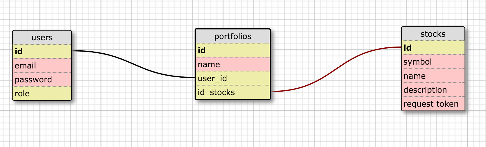

# Pocket-Board

## Schema

## User stories

### - A user can login and logout
### - A user can signup
### - A user can create, view, edit and delete a portfolio
### - A user can add stocks to and remove stocks from a portfolio
### - A user can set the stock allocation in their portfolios
### - A user can do backtesting to their portfolios
### - A user can export the result as PDF

## Wireframe

## installation note

## Deployment Link