# Pocket-Board

## Schema
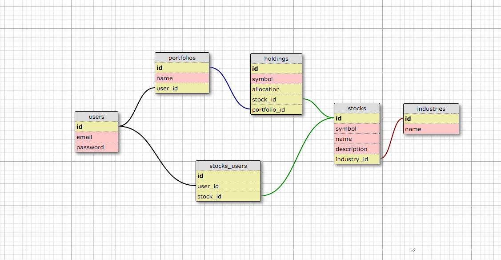

## User stories

#### - A user can login and logout
#### - A user can signup
#### - A user can create, view, edit and delete a portfolio
#### - A user can add stocks to and remove stocks from a portfolio
#### - A user can set the stock allocation in their portfolios
#### - A user can do backtesting to their portfolios
#### - A user can export the result as PDF

## Wireframe

###Homepage
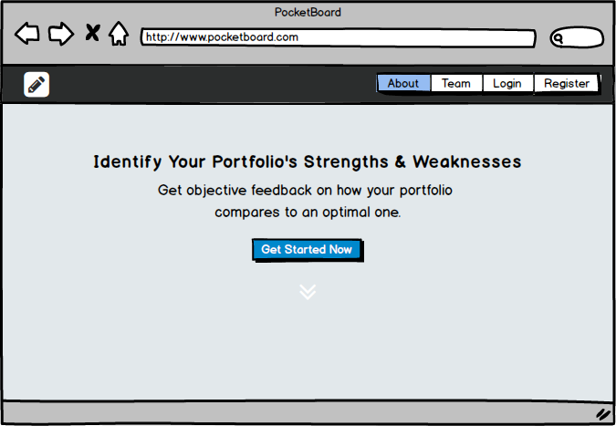

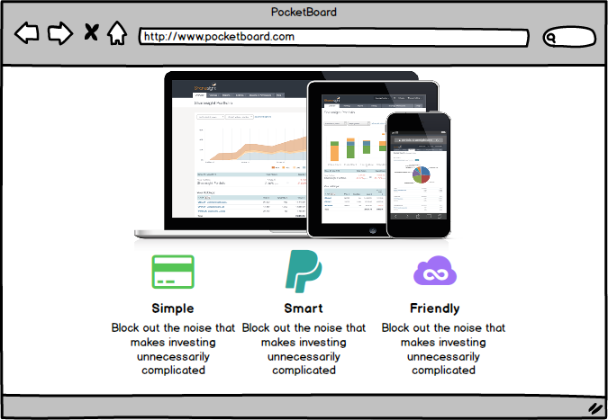

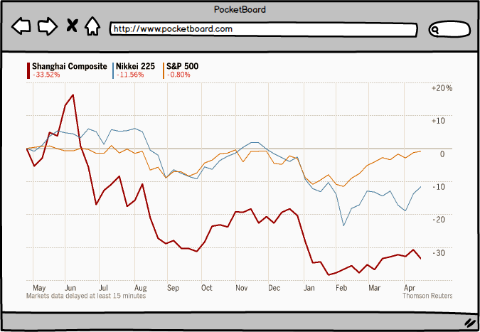

###Signup
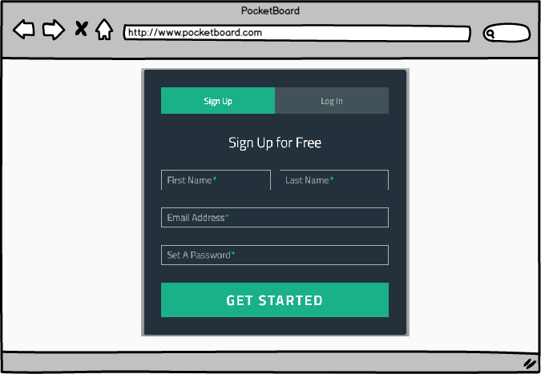

###Login
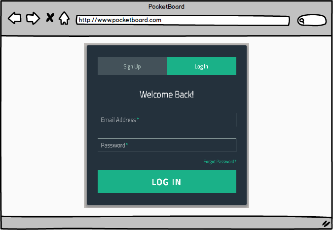

###Dashboard
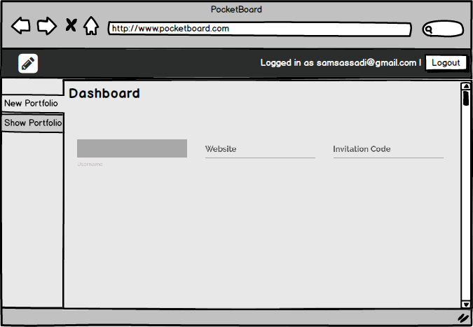

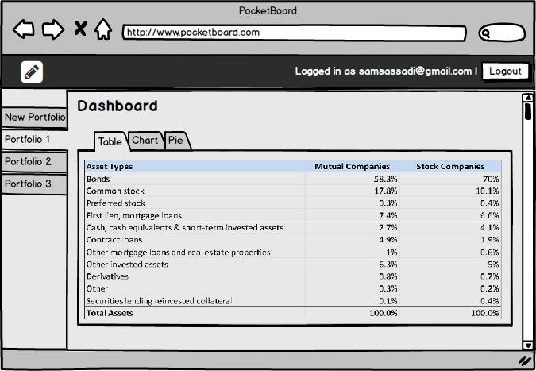

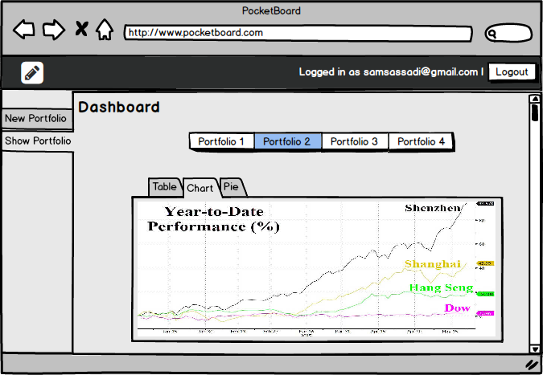

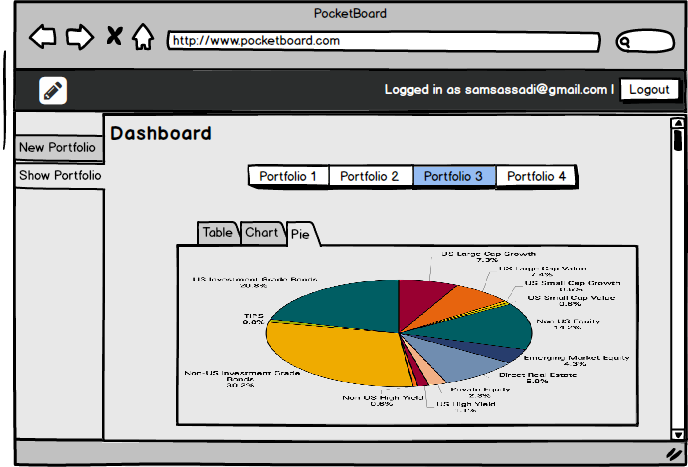

## Our Team
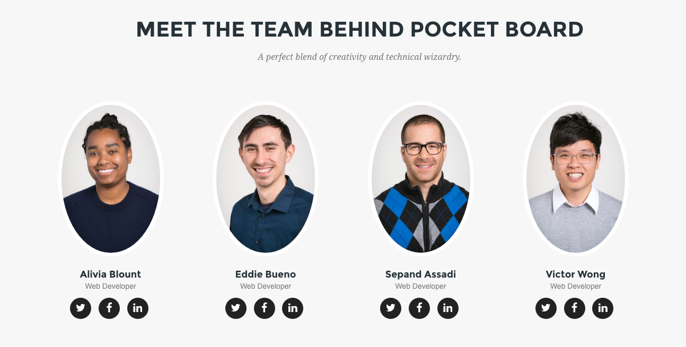

## Presentation
[Live Presentation](https://youtu.be/8QUZFZloCFM)

## Deployment Link
[Heroku](http://pocketboard.herokuapp.com/)
