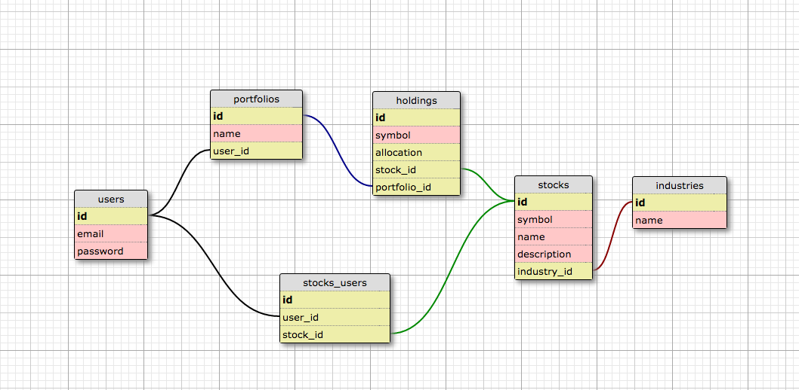
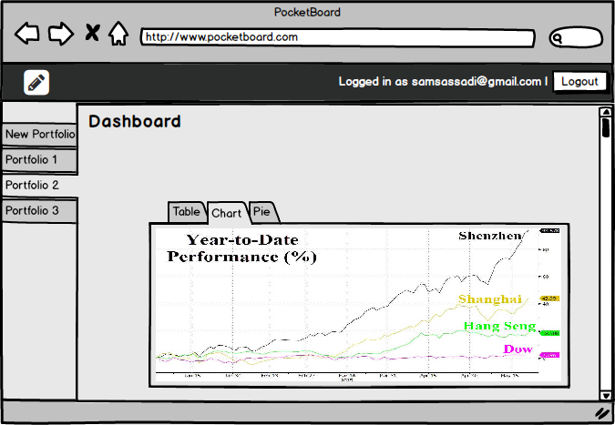
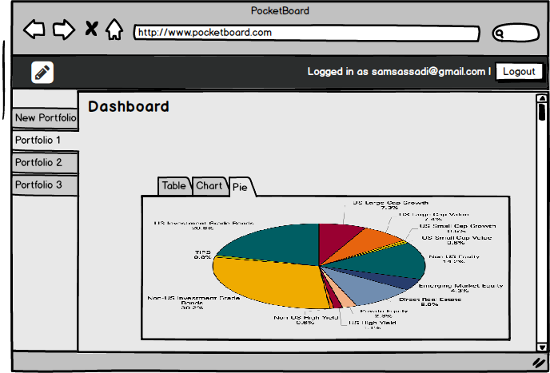

# Pocket-Board

## Schema

## User stories

#### - A user can login and logout
#### - A user can signup
#### - A user can create, view, edit and delete a portfolio
#### - A user can add stocks to and remove stocks from a portfolio
#### - A user can set the stock allocation in their portfolios
#### - A user can do backtesting to their portfolios
#### - A user can export the result as PDF

## Wireframe

###Homepage

###Signup

###Login

###Dashboard

## Our Team

## Presentation
<iframe width="560" height="315" src="https://www.youtube.com/embed/8QUZFZloCFM" frameborder="0" allowfullscreen></iframe>

## Deployment Link
[heroku](http://pocketboard.herokuapp.com/)
